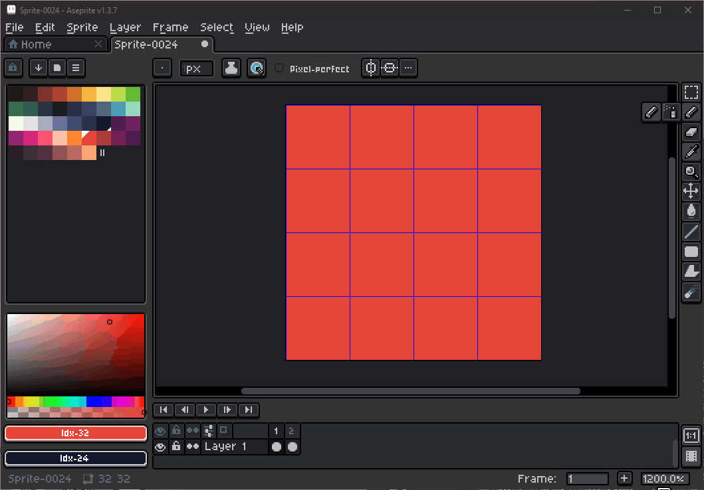
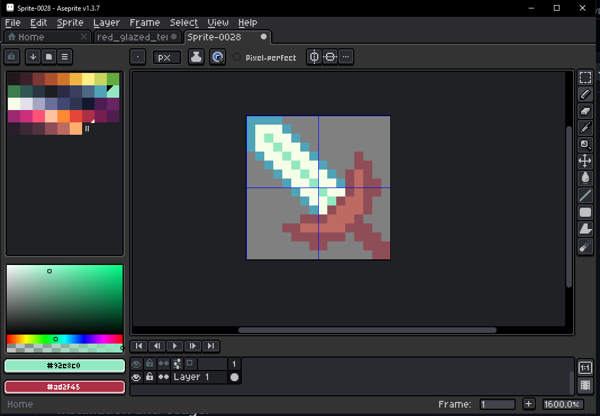
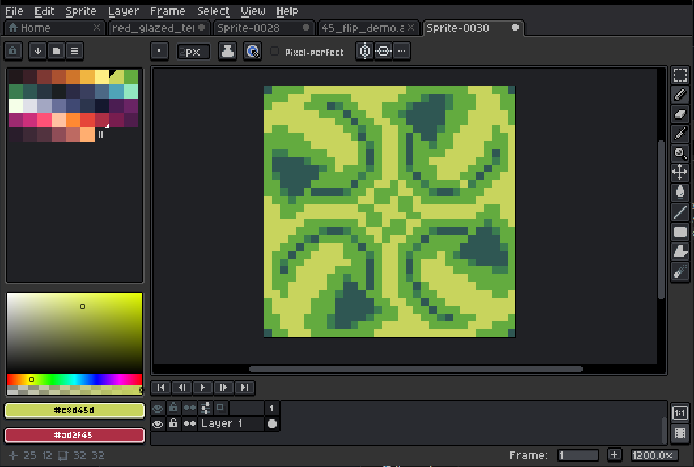

# Aseprite-Glazed-Terracotta-Helpers
Aseprite scripts for helping to make glazed terracotta textures for minecraft.

## Full Feature Glazed Terractota Editor
Uses diagonal symmetry and also rotates the resulting sprite into the 4 quadrants of the sprite.

## Only 45 Degree Symmetry
Diagonal Symmetry by 45 degrees.

## Only Rotate Symmetry
Rotates the bottom right image into the 4 quadrants.

## Installation and Usage:
1. Put .lua scripts into Aseprite scripts folder (File->Scripts->Open Script Folder)

2. Make sure sprite takes up full canvas by placing pixels in the top left and bottom right

3. Run script with File->Scripts->script_to_run

## Also
If you can make this run faster or cleaner, or want to edit bits and pieces to remove/add features, be my guest.

## Why?
There is no script i've seen online for 45 degree mirroring, and since Aseprite wont add it in, ill do it myself.
